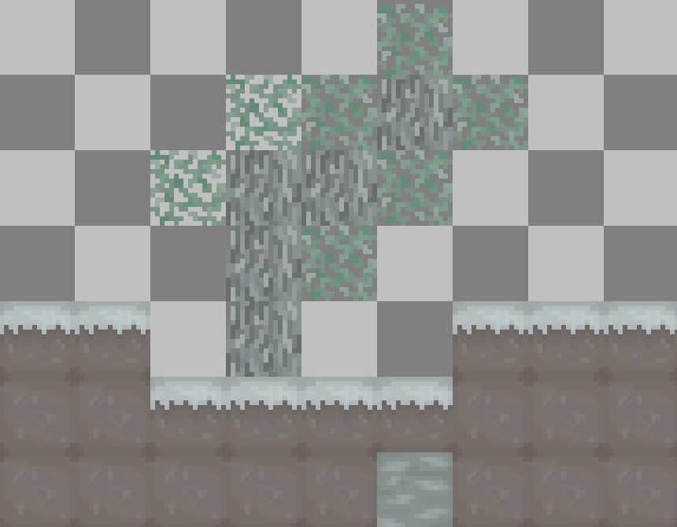

:::warning !!НЕ ПЕРЕВЕДЛЕНА!!
Ждите перевода!
:::

# Биомы

---
> The first thing you need to know is that there are a lot of biomes in fashion, and already there is a large area in them, believe me, which has its own life and its own new items, you can find them out below!

---
### 1. Заснеженый биом
This biome adds a forest in which there is endless snow all year round.
This biome is not a plain like the others, it is a fairly rocky biome that will not bother you, there are dangerous animals in this biome, like a toothless tiger or others, a complete list can be found at this link on the page [PAGE].

### 2. Незаконьченный биом
> Uh.. huh.. wait a sec , i will add this.. maybe tomorrow, yeah..?
